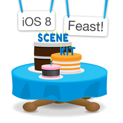

---
title:Scene Kit 上手指南 [翻译]
permalink: SceneKitABC
date: 2017-03-11 09:52:38
tags: 学习笔记
---

# Scene Kit 上手指南 [翻译]

>本文由 Cocoachina 翻译组翻译，由于原文的链接挂kn了，无法正常学习，特此整理了一下图文，放到了新浪图床，以及对文章的稍微润色。
>来源 ：[Cocoachina 原文](http://www.cocoachina.com/ios/20141113/10205.html)  |  [raywenderlich](https://www.raywenderlich.com/83748/beginning-scene-kit-tutorial)




早在iOS 7发布之时苹果带来了一款令人拍案的2D图形框架Sprite Kit，无意间扩展了移动游戏世界的新边疆。Sprite Kit直教开发者们琢磨上整整一年，每个人都能轻松的利用其制作一个iOS小游戏。

然而，进行3D图形开发仍旧困难重重，要么你有强大的专业知识(使用OpenGL ES)，要么就是有用不完的钱(使用Unity Pro)。

然后就没有然后了。

在2012年的WWDC上苹果曾经向Mac OS的开发者介绍过Scene Kit这个东西，像我这样的唯iOS主义者简直心痒痒得不行。不过幸运的是，没过多久Scene Kit就开始进军移动开发界，现在这个让人心动的东西终于在iOS 8上出现了。

虽然Scene Kit的产品定位是针对3D游戏，但是由于其强大的易用性和通用性使得这个神奇的3D框架在非游戏应用上也有长足的发展潜力。


在这篇教程中，我们将通过制作一个3D的碳基分子可视化模型来学习如何构建简单的Scene Kit应用。3D可视化在帮助解释复杂概念时非常有用，比如像化合物分子结构之类的3D模型会使得理解起来更生动，语言描述和图表固不可少，但是使用Scene Kit的话能让这些工作更上一层楼。

#Scene Kit尝鲜
Xcode 6提供了内建的项目模板以便让你能简单的开始一个Scene Kit项目，这倒和Xcode 5中OpenGL游戏模板不一样，Scene Kit对于Xcode算是个重大的革新，因此在开始创建新项目的时候就会有明显的标识可选。在本节中，你会学习到如何按照模板开始一个Scene Kit项目并熟悉它。

打开你的Xcode 6然后新建一个项目，选择**iOS/Application/Game**模板然后点击**Next**。


将项目命名为QuickStart，选择开发语言为Swift，然后游戏选用的平台技术选择为Scene Kit，其他的项目保持原样。接着点击Next，选择你的创建目录然后点击Create。


现在没有必要检查或者修改任何一行代码，你只需要构建并运行就能看到结果了：一个正在转动的3D飞机模型，截图如下:


你可以用任意的方法来描述当前的场景，比如轴线、角度、平面之类的。不过请注意在场景的下方还有一些痛经场景各项数值的标识：

fps:每秒帧数

◆:每帧的绘制调用

△:多边形数量

●:顶点数

而其实要实现这么功能健全的场景仅需要一个文件大概一百来行代码就搞定了，Scene Kit的强大可见一斑。

现在关闭这个项目，我们来从头开始做一个自己的Scene Kit项目。

开始

首先下载一个开始项目，解压并打开CarbonVisualizer.xcodeproject，构建并运行，你会看到的是这样：


这只算一个轻量级的项目文件，你所要做的就是为自己设置各种配置，暂不需要写任何有太大意义的Scene Kit代码，项目中包含了你所需要的所有Swift文件，你只需要按照教程所说的一步一步实现它们就行了。

此外，Main.storyborad包含了一个单独的视图控制器，并附有两个基本的UI元素，且已经链接了ViewController.swift文件。这里还有一个新的元素，即Scene Kit View，打开Main.storyboard看一看可以了解得更多。


SceneKit View是界面生成器的目标库中可以直接拿来用的组件，它的作用是用于渲染3D图形，其实它更像是GLKit View，允许开发者或者设计师迅速设置许多重要的属性。从现在开始，你要做的事都跟编程相关了，你可以愉快的在各种解决方案之间自由切换。

#第一个场景

设置好SCNView之后你首先要做的就是创建一个实际场景来展示图形，不过此前你需要了解一些有关Scene Kit基本的东西…

Scne Kit是基于节点的框架，基本可以用于大型场景图形下简单的建筑和渲染。而在本篇教程中你所要创建并修改的SCNScene对象提供了一个rootNode属性，你可以将其他的SCNNode对象作为它的子节点，这样就可以形成如下图所示的结构树：


使用这种结构有一个好处——在本篇教程里显得更为突出——那就是所有图形的变换都会引起节点的几何变换，并且这种变换还会应用到它的子节点中去。举个例子，一辆3D的法拉利向前疾驰了10英尺，那么所有属于这辆车的部件——包括作为和安全带——都要一起向前10英尺的距离，这都是模拟了真是世界的物理规则的结果。另外每一个组件与其余其他部分的相对位置关系却没有改变，比如说车不动，那么座位也不应该动。

场景图形系统在3D图形应用上是很常见的，你可以阅读相关资料了解更多。

现在我们开始来写代码，要创建一个方形盒子(原作者废话太多，略过)。

我们需要先设置好一个测试场景以方便观瞻这个盒子，所以现在要在ViewController.swift文件中加入下面这个方法，就位于viewDidAppear(animated:)下面：

```objc
// MARK: Scene
func sceneSetup() {  
// 实例化一个空的SCNScene类，接下来要用它做更多的事  
let scene = SCNScene()   
// 定义一个SCNBox类的几何实例然后创建盒子，并将其作为根节点的子节点，根节点就是scene  
let boxGeometry = SCNBox(width: 10.0, height: 10.0, length: 10.0, chamferRadius: 1.0)  
let boxNode = SCNNode(geometry: boxGeometry)  
scene.rootNode.addChildNode(boxNode)   
// 将场景放进sceneView中显示  sceneView.scene = scene
}
```

接着在viewDidAppear(animated:)中添加下面一行，就在suppe调用之后的下一行：    
```objc
sceneSetup()
```    

构建并运行：


如果你比较熟悉OpenGL开发的话你一定会为此结果感到振奋，因为你只需要用这么几行代码就可以在设备上渲染一个场景了。

不过现在暂时还不能看出这是个方形盒子的样子，所以不妨加一下灯光效果让我们能看到它。

在3D场景中，灯光效果是至关重要的，能直接影响感观效果。比如现在你随便看一眼这个所谓的方形盒子就知道没有灯光效果是什么感觉了。好在     SCNView提供了一个属性值来实现启用光照效果，现在在你刚刚添加的sceneSetup方法里面的sceneView.scene = scene下添加如下代码：
```objc
sceneView.autoenablesDefaultLighting = true
```    

构建并运行你就能看到添加灯光之后的效果了。


添加了灯光之后视觉上有了深度感，于是我们能感觉出这是一个正方体的轮廓了。SCNView还有许多很好的用的特性，默认的灯光效果在这里只不过是表面功夫而已(这是一语双关)。

现在这个盒子占据了全部屏幕以至于只能看到一部分，所以我们需要将其缩小以观全貌。下面我们要说的这个SCNView属性成员很适宜用于调试，因为它允许你在场景中随意切换方位。我们可以再sceneSetup()中添加下面这行看起摄像机(观察者)功能：

`sceneView.allowsCameraControl = true`


构建并运行，然后你可以跟场景进行交互了。

**一只手指滑动：**旋转你的观察点。

**两只手指滑动：**移动观察点。

**双指挤压：**缩放/放大场景。

如果说你的iOS模拟器在交互的时候有问题，可以参见iOS模拟器用户手册寻求解决方法。


# 灯光，摄像，Action！
The built-in SCNView features are very useful, but also rather limited. In order to fully customize and control your scene, you must learn how to create and add multiple nodes to your scene graph, of various different types.
As film directors would say, “Lights, camera, action!” :]
Add the following lines to sceneSetup, just below let scene = SCNScene():

```
let ambientLightNode = SCNNode()
ambientLightNode.light = SCNLight()
ambientLightNode.light!.type = SCNLightTypeAmbient
ambientLightNode.light!.color = UIColor(white: 0.67, alpha: 1.0)
scene.rootNode.addChildNode(ambientLightNode)
```

我们添加的这个灯光类型是环境光，且为白光，亮度为67%。

这一类型的光照会均匀的照射场景中所有物体，并且会从各个方向强度不变的照射，有点像是阴天的自然光照。如果你想要场景看上去更为自然一下的话使用这种光照会很有用，否则所有的阴影部分都会渲染为全黑，大多数情况下这样的效果不是很理想的，比如在我们这个教程中就是这样。

作为均匀光照的一种，就环境光照本身而言并不是很完美，因为它在体现物体细节上的能力有限。因此我们需要在场景中增加一个副光，就在刚刚添加的代码下面加入下面这段：

```
let omniLightNode = SCNNode()
omniLightNode.light = SCNLight()
omniLightNode.light!.type = SCNLightTypeOmni
omniLightNode.light!.color = UIColor(white: 0.75, alpha: 1.0)
omniLightNode.position = SCNVector3Make(0, 50, 50)
scene.rootNode.addChildNode(omniLightNode)
```


这种光叫做全向光(编者按：原文omniderectional light，指点光源向各个方向发出强度相等的光照)，或者称为点光源。这种关与环境光一致的地方是其光源强度不会变化，但是它有方向。其光照方向与它跟物体的位置关系相关。比如盒子的默认位置是在(0,0,0)，这样位置在(0,50,50)的点光源就意味着光照是从盒子的前上方射过来的。

>提示：不要太在意这些关于距离单位的细节，场景中所有的位置单位都是由你自己定的，这里的(0,50,50)既不是50米也不是50公里，当然更不是50光年，仅仅只是50个单位长度而已，你完全可以为自己定义合适的计量单位。


现在灯光设置好了，然后删掉sceneSetup()中下面这句：

`sceneView.autoenablesDefaultLighting = true`

构建并运行，缩放转一转，呐，你可以看到这样正方体：


对于本篇教程来说这两个光源已经足够，不过你可以在以后的项目里面再测试一下平行光**(SCNLightTypeDirectional)**或者聚焦光**(SCNLightTypeSpot)**。

接下来我们需要设置摄像机，在刚刚添加光照的语句下面加入下面这几句：

```
let cameraNode = SCNNode()
cameraNode.camera = SCNCamera()
cameraNode.position = SCNVector3Make(0, 0, 25)
scene.rootNode.addChildNode(cameraNode)
```

摄像机节点和灯光节点一样容易设置，至少不会比灯光麻烦。对于一个基本的场景按照默认的设置就已经足够了，因此你无需修改摄像机的焦距、景深和其他属性。你所需要做的就是定义它的位置，将其放在这个盒子的正前方(0,0,25)。

构建并运行，看看摄像机正前方的物体是什么样。


>提示：摄像机默认的投影方式就是透视投影，如果你需要设置正交投影的话可以启用useOrthographicProjection设定适当的OrthographicScale值。

现在使用默认的摄像机控制来查看你的场景，你会发现当你旋转正方体的时候灯光也跟着转动了，因为事实上你选择的是摄像机的位置。

默认的相机控制以及足够好用，但却没有任何定制，所以你还可以自己创建一个摄像机并能完全掌控它。只需要打开ViewController.swift然后在viewDidLoad()的上面添加这些变量：
```
// Geometry
var geometryNode: SCNNode = SCNNode()
 // Gestures
var currentAngle: Float = 0.0
```

仅处理一个正方体是相当容易的，不过当你需要处理两个以上的复杂几何图形的时候，那么把它们作为一个个单独的节点来管理会容易许多。这就要用到geometryNode。

另外，currentAngle可用于修改geometryNode绕Y轴的旋转度，而场景中的其他节点都不会受到影响。

在sceneSetup()下面添加如下方法：
```
func panGesture(sender: UIPanGestureRecognizer) {
  let translation = sender.translationInView(sender.view!)
  var newAngle = (Float)(translation.x)*(Float)(M_PI)/180.0
  newAngle += currentAngle
  
  geometryNode.transform = SCNMatrix4MakeRotation(newAngle, 0, 1, 0)
  
  if(sender.state == UIGestureRecognizerState.Ended) {
    currentAngle = newAngle  }
}
```

当sceneView接收到一个滑动手势时就会调用这个方法，然后它会将手势在X轴方向上的平移变化转换成Y轴上的旋转变换并传递给节点(1 像素 = 1 度)。

在这里使用了旋转矩阵来修改geomtryNode的属性来实现此项功能，不过你也可以使用一个旋转向量来修改旋转特性。使用旋转矩阵更好的原因是你可以继续拓展它的用途，包括平移缩放都可以。
然后再sceneSetup中的sceneView.scene = scene前面添加下面代码：
```
geometryNode = boxNode 
let panRecognizer = UIPanGestureRecognizer(target: self, action: "panGesture:")
sceneView.addGestureRecognizer(panRecognizer)
```

这段代码连接了你的新方法和变量完成了最后设置，现在你要做的就是取消掉控制摄像机，删除这句：
`sceneView.allowsCameraControl = true`

构建并运行，然后用一只手指来旋转这个正方体试试。


>提示：对于本教程而言要用手势完成完整的3D变换有些复杂，不过你可以[参看一些文章](http://www.raywenderlich.com/?p=50398)来了解其原理。

#原子(Atom)
目前为止你的这个正方体运行得一切顺利，当然也是对你制作一个最开始的那种应用会有所帮助。不过现在我们需要抛开正方体来谈点别的。别忘了我们的初衷——使用Scene Kit来制作一个3D的碳基分子可视化模型：随便是天然气分子、乙醇或者是什么聚四氟乙烯之类的。

分子结构一般是球形和条形物体来表示原子的结合，而原子结构呢就相当复杂，不过我们在本篇教程里不会考虑这个的，仅仅使用简单的球体来代表一个原子就够了。模型的确简单，不过对于来表示分子结构的话绰绰有余，如果你想知道为什么绰绰有余可以看[这里](http://en.wikipedia.org/wiki/Ball-and-stick_model)。

所谓碳基分子，你最开始要创建的物体当然是[碳原子](http://en.wikipedia.org/wiki/Carbon)啦，打开Atoms.swift文件并在Atom类中加入下面这个类方法：

```
class func carbonAtom() -> SCNGeometry {  
/* 这是一个预先声明，当然carbonAtom会在后面用到，1.70是指碳原子的范德华半径，就相当于原子的半径，不过是负的10次方级别的了。现在你为场景指定了一个计量单位，之后所有的物体都要以这个单位为准 */
let carbonAtom = SCNSphere(radius: 1.70)   /*firstMaterial是SCNMaterial的一个属性，定义的是原子的材质，其实就是覆盖在其表面的贴图，在Scene Kit中你可以将其赋值为颜色、纹理或者其他源材质，如果想了解跟更多请参见OpenGL ES的相关资料  */
carbonAtom.firstMaterial!.diffuse.contents = UIColor.darkGrayColor()   
/* 镜面材质其实就是另一层贴图，将会在表面产生反射效果，对于大多数材质来说一般都用纯白色 */
 carbonAtom.firstMaterial!.specular.contents = UIColor.whiteColor()   
 /* 本教程在原子的创建上使用了工厂模式，对于在多原子结构的分子构建来说会相当有用，使用该公开方法可以返回一个模式化的几何图形 */
  return carbonAtom
}
```

>提示：如果你刚刚接触Swift，那么你需要知道一个类方法(或者说类型方法)，会在类声明时调用，而非实例化的时候。
现在你可以理解如何编写碳原子的生成方法了，剩下的原子也不难写了，一样是在Atom类中，剩下种类的原子生成方法如下：

```
class func hydrogenAtom() -> SCNGeometry {  
let hydrogenAtom = SCNSphere(radius: 1.20)  
hydrogenAtom.firstMaterial!.diffuse.contents = UIColor.lightGrayColor()  
hydrogenAtom.firstMaterial!.specular.contents = UIColor.whiteColor()  return hydrogenAtom
}
 
class func oxygenAtom() -> SCNGeometry {  
 let oxygenAtom = SCNSphere(radius: 1.52)  
 oxygenAtom.firstMaterial!.diffuse.contents = UIColor.redColor()  
 oxygenAtom.firstMaterial!.specular.contents = UIColor.whiteColor()  
 return oxygenAtom
} 
 
class func fluorineAtom() -> SCNGeometry {  
let fluorineAtom = SCNSphere(radius: 1.47)  
fluorineAtom.firstMaterial!.diffuse.contents = UIColor.yellowColor()  
fluorineAtom.firstMaterial!.specular.contents = UIColor.whiteColor()  
return fluorineAtom
}
```

现在你拥有了**氢、氧、氟**三种分子了。

所有的原子都用了相同的方法模式创建并且仅在半径和外观上有所不同。为了能让它们同时显示出来，你需要将它们加入一个单独的节点中，所以在Atom类中还要加入下面这种方法，只需要加在类最后就行：

```
class func allAtoms() -> SCNNode {
  let atomsNode = SCNNode()
  
  let carbonNode = SCNNode(geometry: carbonAtom())
  carbonNode.position = SCNVector3Make(-6, 0, 0)
  atomsNode.addChildNode(carbonNode)
  
  let hydrogenNode = SCNNode(geometry: hydrogenAtom())
  hydrogenNode.position = SCNVector3Make(-2, 0, 0)
  atomsNode.addChildNode(hydrogenNode)
  
  let oxygenNode = SCNNode(geometry: oxygenAtom())
  oxygenNode.position = SCNVector3Make(+2, 0, 0)
  atomsNode.addChildNode(oxygenNode)
  
  let fluorineNode = SCNNode(geometry: fluorineAtom())
  fluorineNode.position = SCNVector3Make(+6, 0, 0)
  atomsNode.addChildNode(fluorineNode)
  
  return atomsNode
  }
  ```
  
  好吧这段有点复杂，不过很好理解。这里生成并返回了一个节点然后添加了四个孩子，每种原子为一个子节点。并沿着X轴放置，为了能在场景中看到他们你需要打开ViewController.swift然后在viewDidAppear(animated:)里调用sceneSetup()之后添加如下代码，
  
  ```
  geometryLabel.text = "Atoms\n"
geometryNode = Atoms.allAtoms()
sceneView.scene!.rootNode.addChildNode(geometryNode)
```

最后，移除你之前的正方体，只需要删除sceneSetup中的下面几句：

```
let boxGeometry = SCNBox(width: 10.0, height: 10.0, length: 10.0, chamferRadius: 1.0)
let boxNode = SCNNode(geometry: boxGeometry)
scene.rootNode.addChildNode(boxNode)
geometryNode = boxNode
```

构建并运行，这时候你就能看如下的图形了：


#分子(Molecule)

现在来构建一个分子的3D模型，使用的是刚刚创建的原子。

你会学习如何分别构建分子，基本都是一个模式。只要学习一种基础的就行，打开Molecules.swfit文件在Molecules类中添加下面的方法：

```
class func methaneMolecule() -> SCNNode {
  var methaneMolecule = SCNNode()
  return methaneMolecule}class func ethanolMolecule() -> SCNNode {
  var ethanolMolecule = SCNNode()
  return ethanolMolecule}
 class func ptfeMolecule() -> SCNNode {
  var ptfeMolecule = SCNNode()
  return ptfeMolecule
  }
  ```
  
  和原子一样使用的是工厂模式。不过这里返回的是节点以便你直接将其扔到场景中去。

下面修改ViewController.swift然后在segmentValueChanged(sender:)方法中添加下面代码：

```
// 无论你什么时候选择了一个新的部分，场景中的模型都会更新到下一个，而之前的会被清空，而且一定是从它的父节点一起删除，所有的旋转角度都会被重置
geometryNode.removeFromParentNode()
currentAngle = 0.0
 
// 新的模型会被分配给geometryNode，geometryLabel则会更新模型的名称
switch sender.selectedSegmentIndex {
case 0:
  geometryLabel.text = "Atoms\n"
  geometryNode = Atoms.allAtoms()
  case 1:
  geometryLabel.text = "Methane\n(Natural Gas)"
  geometryNode = Molecules.methaneMolecule()
  case 2:
  geometryLabel.text = "Ethanol\n(Alcohol)"
  geometryNode = Molecules.ethanolMolecule()
  case 3:
  geometryLabel.text = "Polytetrafluoroethylene\n(Teflon)"
  geometryNode = Molecules.ptfeMolecule()
  default:
  break
  }
 // 最后，把新的模型添加到了场景中
 sceneView.scene!.rootNode.addChildNode(geometryNode)

```

构建并运行，分段选择，你会发现不管你切换成什么分子场景中空无一物，那是因为你还没有创建分子，现在确人所有的标签文本在你切换的时候都会变化。请注意从一开始选择之后那几个原子会一直显示在原地不动。

#甲烷(Methane)
甲烷是天然气的主要成分，由四个氢原子和一个碳原子构成，分子式是CH4，为其3D建模相当简单，碳原子居中然后氢原子平均分布在它周围就好了。

打开Molecules.swift文件在Molecules类中添加下面方法：

```
class func nodeWithAtom(atom: SCNGeometry, molecule: SCNNode, position: SCNVector3) -> SCNNode {
  let node = SCNNode(geometry: atom)
  node.position = position
  molecule.addChildNode(node)
  return node
  }
  ```
  
所有的分子构建基本都是下面三步：

1.初始化一个节点。

2.设置位置。

3.将该节点加到分子节点下作为子节点。

当然前面的方法还不够，仅仅只是构建了各原子间的关系。

现在将**methaneMelecule**方法替换成如下：

```
class func methaneMolecule() -> SCNNode {
  var methaneMolecule = SCNNode()
  
  // 1 Carbon
  let carbonNode1 = nodeWithAtom(Atoms.carbonAtom(), molecule: methaneMolecule, position: SCNVector3Make(0, 0, 0))
  
  // 4 Hydrogen
  let hydrogenNode1 = nodeWithAtom(Atoms.hydrogenAtom(), molecule: methaneMolecule, position: SCNVector3Make(-4, 0, 0))
  let hydrogenNode2 = nodeWithAtom(Atoms.hydrogenAtom(), molecule: methaneMolecule, position: SCNVector3Make(+4, 0, 0))
  let hydrogenNode3 = nodeWithAtom(Atoms.hydrogenAtom(), molecule: methaneMolecule, position: SCNVector3Make(0, -4, 0))
  let hydrogenNode4 = nodeWithAtom(Atoms.hydrogenAtom(), molecule: methaneMolecule, position: SCNVector3Make(0, +4, 0))
  
  return methaneMolecule
  }
  ```
  
  这也很长，不过还是可以理解的。在这段代码里面你添加了一个碳原子在你的分子中心(0,0,0)，然后将氢原子放在其周围(想想东南西北)。

构建并运行。直接切换到甲烷来看看你刚刚做的模型。


#拓展
这里有一个完成好的[示例工程文件](http://cdn1.raywenderlich.com/wp-content/uploads/2014/09/CarbonVisualizer-Final.zip)，你也可以在[GitHub](https://github.com/ricardo-rendoncepeda/CarbonVisualizer)上找到这个项目。

你现在已经入门了Scene Kit，并学习到有关3D API的用法了。


